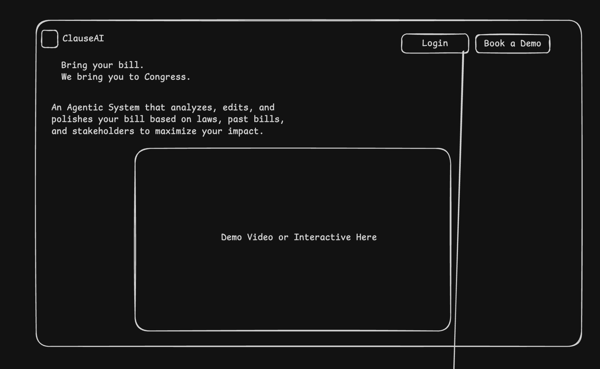

# ClauseDev

ClauseDev is an experimental AI-assisted legislative drafting workspace for analyzing, comparing, and revising bill text.

The short version: it is a full-stack prototype that combines a FastAPI backend, a React/Vite client, an Electron desktop shell, local PostgreSQL databases, and model-backed drafting workflows aimed at policy and legal writing.

It is not a one-command polished SaaS deploy yet. It is a serious working prototype with real architecture, real moving pieces, and some rough edges that are still visible in the repo.

## What The Project Is

ClauseDev is trying to behave like a drafting workstation for legislation rather than a simple chatbot.

Current product direction in the codebase:

- Upload or create a bill-centered project
- Extract and edit bill metadata
- Search bills and laws databases
- Generate similar-bill analysis
- Generate legal conflict analysis
- Generate stakeholder analysis
- Move into a final drafting/editor workflow with AI assistance
- Support either local Codex-backed flows or an OpenAI-compatible endpoint

At a systems level, the project is built more like an agentic application than a thin prompt wrapper:

- React + Vite frontend for the main product UI
- Electron wrapper for desktop distribution
- FastAPI backend for auth, projects, workflow orchestration, settings, editor APIs, and chat
- Split Postgres databases for user state vs. reference/legal corpora
- Prompt-driven workflow services for extraction, metadata, drafting, and analysis
- Playwright coverage for basic end-to-end smoke testing

## Current Repo Layout

This repository contains more than one iteration of the project.

- `ClauseDev/`: the main active app codebase
- `clauseainaviprod/`: a parallel/newer branch of implementation work
- `OldClauseDev/`: earlier experiments and archived steps

If you want to run the current app, start in:

```bash
cd ClauseDev
```

From that point on, the paths in this README assume you are inside the nested `ClauseDev/` app directory.

## Screenshots

These are current product/wireframe references that live in the repo today.

Landing concept:



Bills database flow:


Drafting/editor workflow concept:


## Tech Stack

- Frontend: React 19, React Router 7, Vite, TypeScript, TanStack Query
- Desktop shell: Electron
- Backend: FastAPI, SQLAlchemy, Pydantic Settings, Alembic-ready structure
- Python tooling: `uv`
- Databases: PostgreSQL
- Testing: Playwright, pytest, Ruff
- Model/runtime support:
  - OpenAI-compatible `/chat/completions` backends
  - Local Codex OAuth fallback
  - Local Codex app-server integration for editor/runtime flows

## Architecture Notes

The architecture in the repo is more ambitious than a normal CRUD app.

Key implementation ideas already present:

- Dual-database split
  - `clauseai-db-user` for auth, projects, workflow runs, history, and user-owned app state
  - `clauseai-db` and related reference databases for legal/reference search data
- Workflow-first backend
  - the backend is organized around staged drafting/analysis workflows rather than only page-level endpoints
- Pluggable model backend strategy
  - the app can route model calls through local Codex auth or a user-supplied OpenAI-compatible API
- Desktop + web posture
  - the same product is being shaped for browser development and packaged desktop usage

## What Actually Exists Right Now

Based on the code in `ClauseDev/`, the main app currently includes:

- Marketing/homepage route
- Login and signup
- Protected app shell
- Bills home
- Bills database
- Laws database
- Chat workspace
- Settings page for model endpoint configuration
- Project workflow stages:
  - upload
  - extraction
  - metadata
  - similar bills
  - legal
  - stakeholders
  - final editor

The backend API currently wires up routers for:

- health
- auth
- projects
- pipeline
- reference
- workflow content
- editor
- settings
- chat

## Prerequisites

You will need:

- Node.js + npm
- Python 3.14+
- [`uv`](https://docs.astral.sh/uv/)
- PostgreSQL

Optional, but important if you want the intended AI workflow:

- Codex CLI with local auth
- a running local Codex app-server for the editor/runtime flow

## Getting Started

### 1. Clone the repo

```bash
git clone https://github.com/NavilanSanthanakrishnan/ClauseDev.git
cd ClauseDev/ClauseDev
```

### 2. Install backend dependencies

```bash
cd backend
uv sync
cd ..
```

### 3. Install frontend and desktop dependencies

```bash
npm install
npm --prefix frontend install
```

### 4. Create your backend env file

```bash
cp backend/.env.example backend/.env
```

The example environment currently includes:

```env
CLAUSEAI_APP_ENV=local
CLAUSEAI_DEBUG=true
CLAUSEAI_CORS_ORIGINS=["http://localhost:5173","http://127.0.0.1:5173"]
CLAUSEAI_USER_DATABASE_URL=postgresql+psycopg:///clauseai-db-user
CLAUSEAI_REFERENCE_DATABASE_URL=postgresql+psycopg:///clauseai-db
CLAUSEAI_JWT_SECRET=change-me-in-env
```

### 5. Provision PostgreSQL databases

At minimum, the app expects local Postgres databases for:

- `clauseai-db-user`
- `clauseai-db`

The codebase also has defaults for additional reference stores:

- `openstates`
- `california_code`
- `clause_legal_index`
- `uscode_local`

If those are not populated, the UI can still boot, but reference-heavy features will be incomplete.

### 6. Start the backend

```bash
cd backend
uv run clauseai-api
```

This starts the FastAPI server on:

```text
http://127.0.0.1:8000
```

### 7. Start the frontend

In a second terminal:

```bash
npm --prefix frontend run dev
```

This starts the web client on:

```text
http://127.0.0.1:5173
```

### 8. Start the desktop shell (optional)

If you want the Electron wrapper during development:

```bash
npm run dev:desktop
```

## Running The AI Layer

ClauseDev supports two practical modes.

### Option A: Local Codex-backed mode

Use this if you want the local-editor workflow the project is built around.

1. Log into Codex locally:

```bash
codex login
```

2. Make sure your local auth file exists:

```text
~/.codex/auth.json
```

3. Start the local Codex app-server if your editor flow depends on it.

By default, the backend expects:

```text
ws://127.0.0.1:8766
http://127.0.0.1:8766/readyz
```

### Option B: OpenAI-compatible mode

Use this if you want analysis/chat calls to route to a standard `/v1/chat/completions` provider.

Examples:

- OpenAI
- Ollama
- LM Studio
- llama.cpp-compatible servers

The current app stores these settings through the UI and saves them backend-side.

## Useful Commands

```bash
# backend
cd backend && uv run clauseai-api
cd backend && uv run pytest
cd backend && uv run ruff check

# frontend
npm --prefix frontend run dev
npm --prefix frontend run build
npm --prefix frontend run lint
npm --prefix frontend run typecheck

# electron packaging
npm run package:mac
npm run package:win

# e2e
npx playwright test
```

## Honest Status

This repo is technically substantial, but it is still an in-progress build.

What is true today:

- there is real full-stack app code here
- there is a real desktop/web architecture here
- there is a real workflow model here
- there are existing UI flows, API routes, settings, and packaging scripts

What is also true today:

- the repo still contains multiple generations of work
- some UI assets are wireframes rather than final polished product screenshots
- full legal/reference search depends on local database setup and ingestion data
- the drafting/editor flow depends on local runtime pieces that are not plug-and-play for every machine

So the honest framing is:

ClauseDev is a serious prototype for AI-assisted legislative drafting infrastructure, not a finished public product.

## Why This Project Is Interesting

Most “AI for law” demos stop at chat.

ClauseDev is more interesting because it is aiming at a higher-order workflow:

- structured project state
- staged legal analysis
- reference retrieval
- iterative draft refinement
- version-aware editing
- local runtime control instead of only remote black-box prompting

That makes it closer to an operating environment for drafting than a single-purpose assistant.

## License

No license file is currently included in the repository. If you plan to make this public, adding a license is worth doing next.
